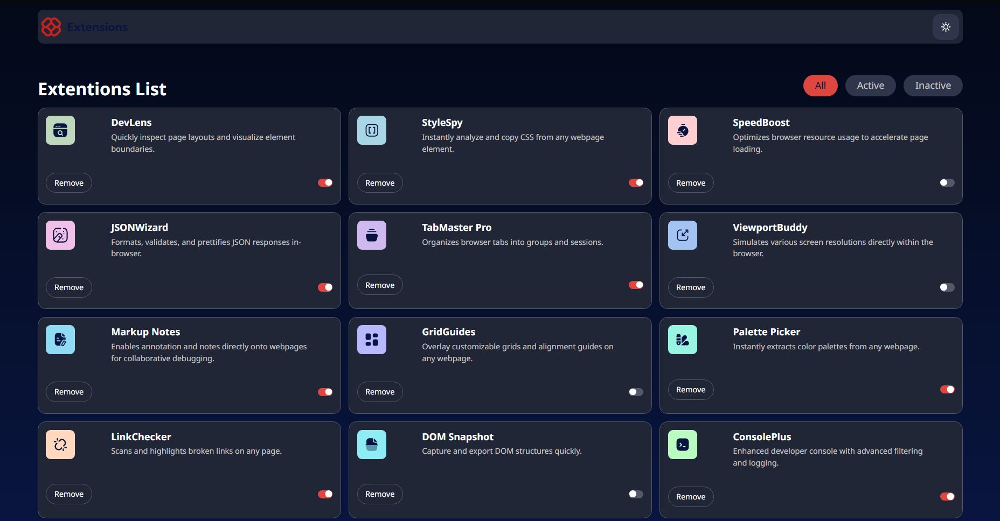

# Frontend Mentor - Browser extensions manager UI solution

This is a solution to the [Browser extensions manager UI challenge on Frontend Mentor](https://www.frontendmentor.io/challenges/browser-extension-manager-ui-yNZnOfsMAp). Frontend Mentor challenges help you improve your coding skills by building realistic projects. 

## Table of contents

- [Overview](#overview)
  - [The challenge](#the-challenge)
  - [Screenshot](#screenshot)
  - [Links](#links)
- [My process](#my-process)
  - [Built with](#built-with)
- [Author](#author)

## Overview

### The challenge

Users should be able to:

- Toggle extensions between active and inactive states
- Filter active and inactive extensions
- Remove extensions from the list
- Select their color theme
- View the optimal layout for the interface depending on their device's screen size
- See hover and focus states for all interactive elements on the page

### Screenshot

### Links

- Solution URL: [Add solution URL here](https://www.frontendmentor.io/solutions/browser-extensions-manager-ui-main-aR51oHWrXx)
- Live Site URL: [Add live site URL here](https://luisortega27.github.io/browser-extensions-manager-ui-main/)

## My process

### Built with

- Semantic HTML5 markup
- CSS custom properties
- Flexbox
- CSS Grid
- Mobile-first workflow
- Javascript
- Fetch
- [React](https://reactjs.org/) - JS library
- [Tailwind](https://tailwindcss.com) - For styles

## Author

- Portfolio - [Luis F. Ortega](https://luisortega27.github.io/portfolio/)
- Frontend Mentor - [@LuisOrtega27](https://www.frontendmentor.io/profile/LuisOrtega27)
- Github - [LuisOrtega27](https://github.com/LuisOrtega27)